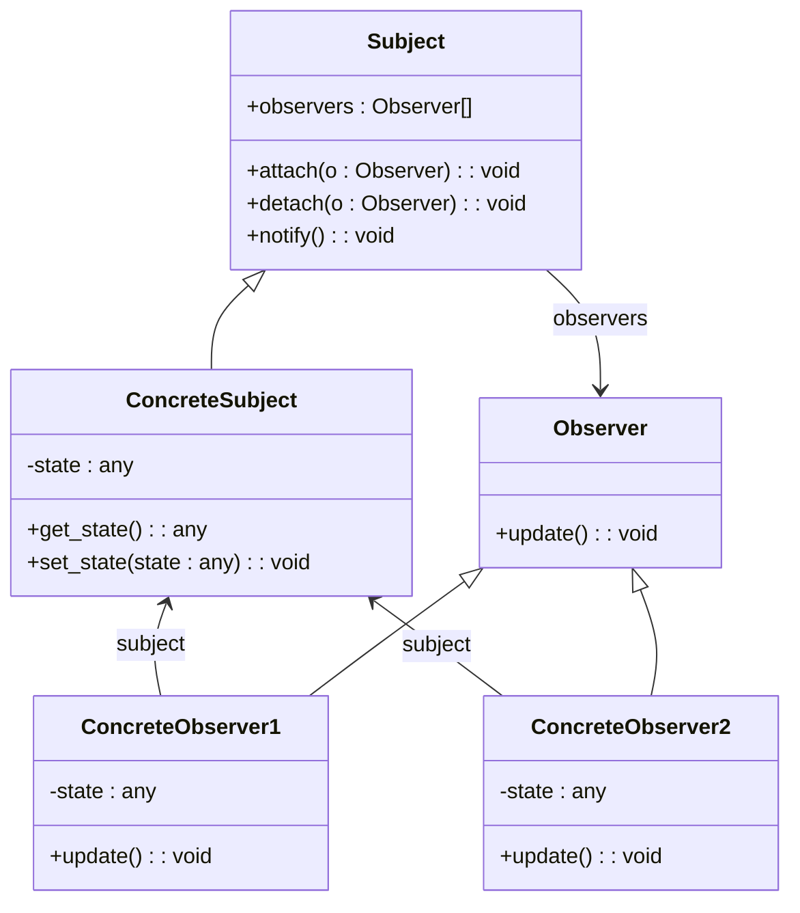

# Observer Pattern
The observer pattern is a software design pattern where a subject object keeps track of its observers and automatically calls one of their methods to notify them of any state changes.

It is frequently used in event-driven software to construct distributed event-handling systems. These systems typically refer to the subject as a "stream of events" or "stream source of events," while the observers are referred to as "sinks of events."

# Diagram
